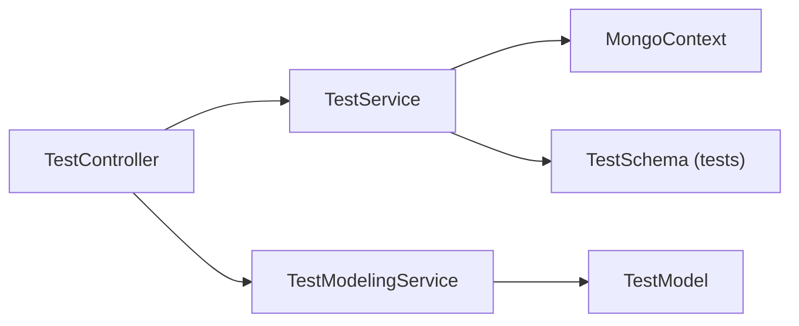

# Qubbi App: Server

> [!summary]
> NestJS server workspace with MongoDB persistence, Swagger, and validation/filter middleware.

## Role

- Main backend API for editor and component domain.
- Exposes REST endpoints under `editor/*` namespace.
- Owns MongoDB schemas documented in [[Schemas/Qubbi - Schema - Overview]].

## Runtime Setup

- Package name: `server`
- Framework: NestJS (`@nestjs/*`) + Mongoose
- Environment:
- `MONGO_URI` for DB connection (`infrastructure/mongodb.ts`)
- `SERVER_PORT` for HTTP port (`main.ts`, default `3000`)

## Boot Flow

- `src/main.ts`:
- Creates app from `AppModule`
- Registers Swagger at `/api`
- Registers `GlobalExceptionFilter`
- Registers global `ValidationPipe` with `whitelist` and `forbidNonWhitelisted`
- Listens on `SERVER_PORT`

## Current API Surface

| Method | Path | Controller Method | Behavior |
| --- | --- | --- | --- |
| `GET` | `/editor/test` | `list()` | list all test documents |
| `GET` | `/editor/test/:id` | `single()` | fetch one test document |
| `PUT` | `/editor/test` | `create()` | create new test document |
| `POST` | `/editor/test` | `update()` | update existing test document |
| `DELETE` | `/editor/test/:id` | `delete()` | soft delete by setting `deletedTime` |

## Internal Flow

## Data Model Links

- [[Schemas/Qubbi - Schema - Test]]
- [[Schemas/Qubbi - Schema - Component]]
- [[Schemas/Qubbi - Schema - Component Variant]]
- [[Schemas/Qubbi - Schema - Component Prop]]
- [[Schemas/Qubbi - Schema - Component Style]]
- [[Schemas/Qubbi - Schema - Component Style Value]]
- [[Schemas/Qubbi - Schema - Component Behavior]]

## Contract Coupling

- Imports `@qubbi/contract` enums in component schema files.
- Shared contract source: [[Packages/Qubbi - Package - Contract]]

## Implementation Note

- `services/component/component-manifest-modeling.service.ts` is currently commented out and not active.

## Linked Notes

- [[Qubbi - Project Overview]]
- [[Qubbi - Workspace Map]]
- [[Packages/Qubbi - Package - Contract]]
