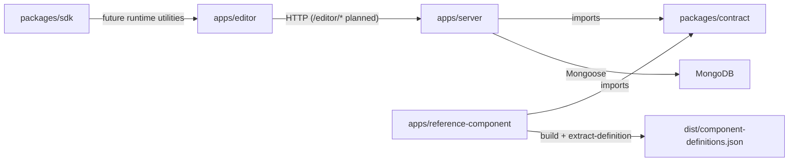

# Qubbi Project Overview

> [!summary]
> `qubbi` is a TypeScript monorepo for editor/server/component-definition workflows.

## System Intent

- Build a component-driven UI platform with:
- editor runtime (`apps/editor`)
- API + persistence layer (`apps/server`)
- reference component definitions + extraction (`apps/reference-component`)
- shared domain contract (`packages/contract`)
- SDK placeholder (`packages/sdk`)

## Monorepo Layout

- Workspace spec: `pnpm-workspace.yaml` -> `apps/*`, `packages/*`
- Task orchestration: `turbo.json`
- Root scripts:
- `pnpm dev` -> `turbo watch dev`
- `pnpm build` -> `turbo run build`
- `pnpm lint` -> `turbo run lint`

## Architecture Map

## Linked Notes

- [[Qubbi - Workspace Map]]
- [[Qubbi - Graph Seed]]
- [[Apps/Qubbi - App - Editor]]
- [[Apps/Qubbi - App - Server]]
- [[Apps/Qubbi - App - Reference Component]]
- [[Packages/Qubbi - Package - Contract]]
- [[Packages/Qubbi - Package - SDK]]
- [[Schemas/Qubbi - Schema - Overview]]
