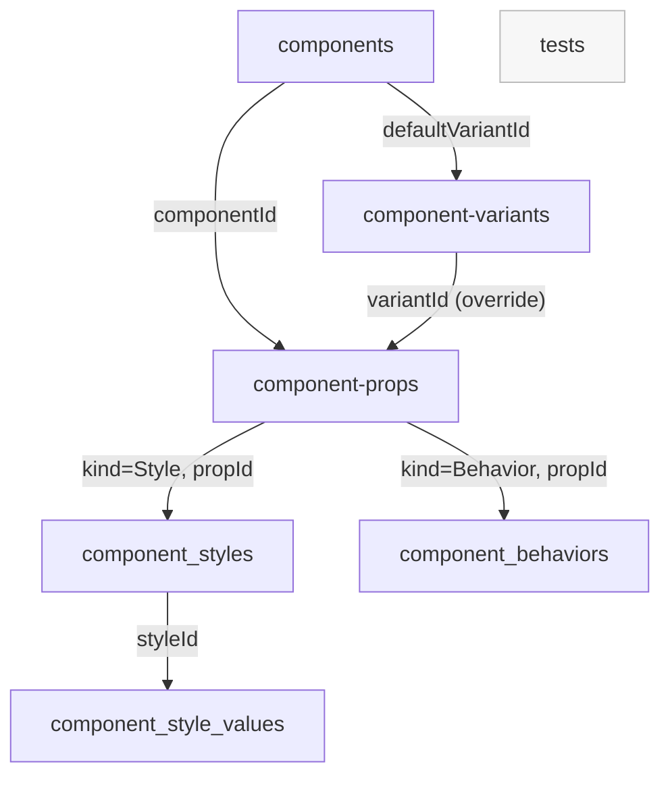

# Qubbi Schema Overview

> [!summary]
> MongoDB schema map defined in `apps/server/src/schemas`.

## Collections

| Schema Note | Collection | Source File |
| --- | --- | --- |
| [[Schemas/Qubbi - Schema - Test]] | `tests` | `apps/server/src/schemas/test/test.schema.ts` |
| [[Schemas/Qubbi - Schema - Component]] | `components` | `apps/server/src/schemas/component/component.schema.ts` |
| [[Schemas/Qubbi - Schema - Component Variant]] | `component-variants` | `apps/server/src/schemas/component/component-variant.schema.ts` |
| [[Schemas/Qubbi - Schema - Component Prop]] | `component-props` | `apps/server/src/schemas/component/component-prop.schema.ts` |
| [[Schemas/Qubbi - Schema - Component Style]] | `component_styles` | `apps/server/src/schemas/component/component-style.schema.ts` |
| [[Schemas/Qubbi - Schema - Component Style Value]] | `component_style_values` | `apps/server/src/schemas/component/component-style-value.schema.ts` |
| [[Schemas/Qubbi - Schema - Component Behavior]] | `component_behaviors` | `apps/server/src/schemas/component/component-behavior.schema.ts` |

## Relationship Graph

## Cross-Cutting Keys

- `projectId` appears in all component-domain collections.
- Soft-delete pattern: most collections include `deletedTime`.

## Contract Coupling

- Enum constraints are imported from [[Packages/Qubbi - Package - Contract]].

## Linked Notes

- [[Apps/Qubbi - App - Server]]
- [[Qubbi - Graph Seed]]
